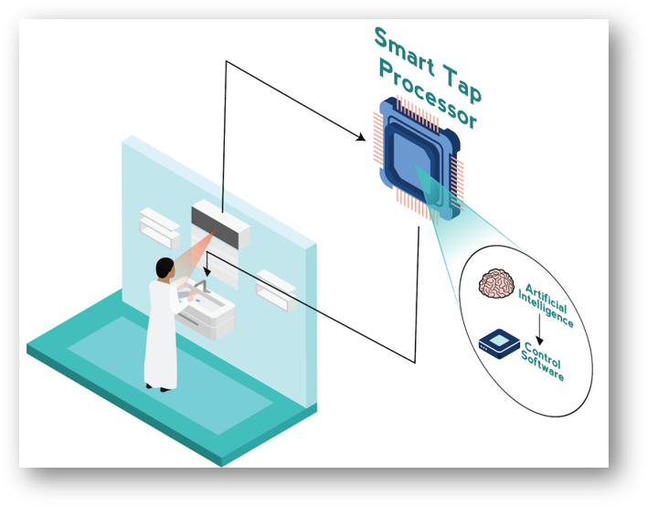

# NEOM_AI_Challenge

## A team from KAUST with Utopia Project (AI Tap Solution)

In folder Python-Kinect: There are several different version of codes: a). GPU: using GPU to process joint data; b). MCU: send tap status to MCU for tap control; c). send tap status to Unity (virtual environment).

We are using PyKinectV2 library to read body joints information from a Kinect sensor. A trained GCN (graph convolutional network) is used to classify the body joints information and the classified result will indicate the on/off of the tap.

* The GCN model we are using can be found here:
https://github.com/yysijie/st-gcn

* A simulated virtual environment project (using Unity 3D in C#)can be found in google drive: 
https://drive.google.com/file/d/1soYIrwCWAmmvXzajIpmVFe5DvwvXIbCw/view?usp=sharing

* The video showing two demos (VR demo and onsite demo) can be found in: 
https://www.youtube.com/watch?v=5-30Z7Omugw

